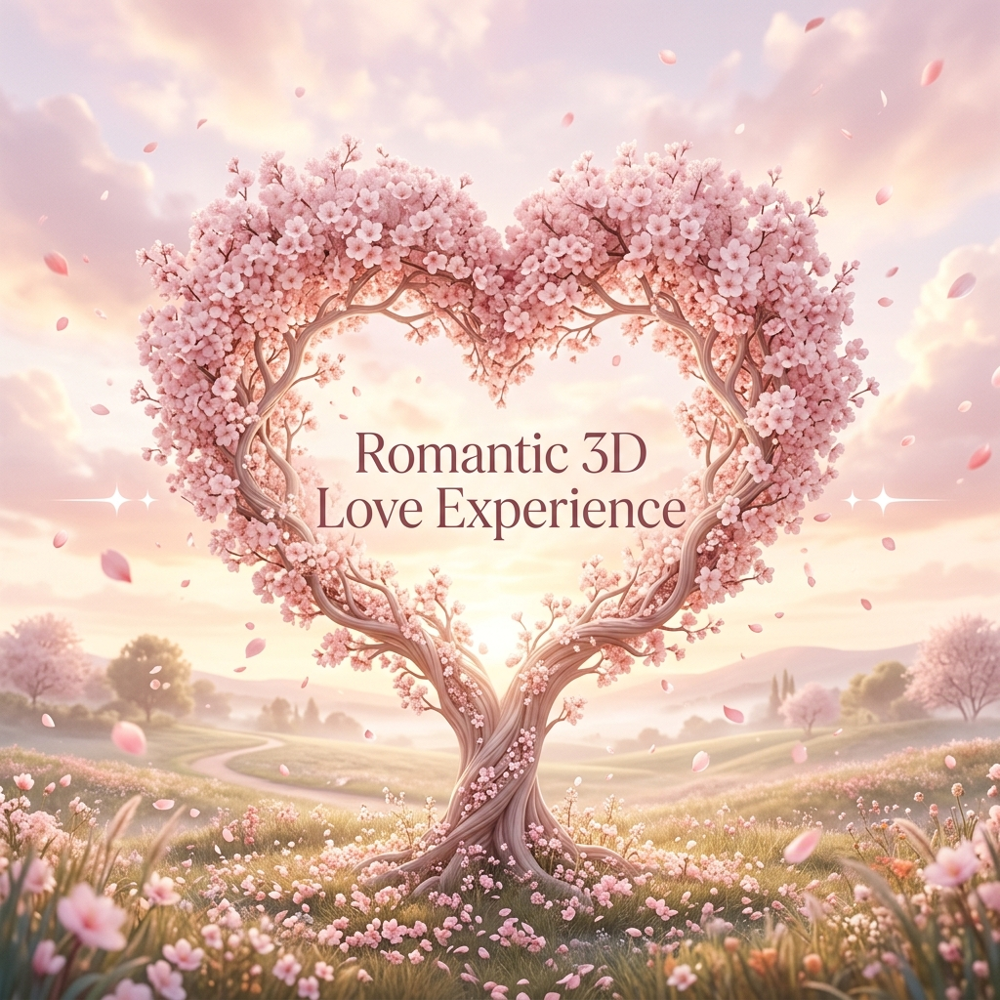

<!-- Banner Image -->
<div align="center">
  <picture>
    <source media="(prefers-color-scheme: dark)" srcset="./docs/banner-dark.png">
    <source media="(prefers-color-scheme: light)" srcset="./docs/banner-">
    
  </picture>
</div>

<br />

<div align="center">
  <h1>💖 A Romantic 3D Web Experience</h1>
  <p>A deeply immersive, highly interactive, and personalized cinematic 3D web experience built to ask someone out and tell them how much they mean to you.</p>
</div>

<br />


## ✨ Features

- **Interactive 3D Heart Tree:** Built with React Three Fiber, featuring mouse-reactive particles and bursting heart interactions.
- **The "Unclickable" NO Button:** A playful cat-and-mouse game where the "NO" button shrinks, runs away, and triggers cute, escalating reactions while the "YES" button begs to be clicked.
- **Cinematic "YES" Transition:** A full-screen glassmorphic transition replacing the UI with a beautiful, floating cherry blossom particle scene.
- **Beat-Synced Music Engine:** Custom Web Audio API integration that smoothly fades in a romantic soundtrack and syncs the entire visual aesthetic (glows, petals, and hearts) to the rhythm of the beat!
- **Personalized Mini-Game:** A relaxing "Heart Collector" game designed to reveal deeply personal, emotional traits before concluding with a heartfelt love letter.

<br />

## 🛠️ Technology Stack

- **Framework:** [Next.js](https://nextjs.org/) (React 18+)
- **Styling:** [Tailwind CSS](https://tailwindcss.com/)
- **Animations:** [Framer Motion](https://www.framer.com/motion/)
- **3D Rendering:** [React Three Fiber](https://docs.pmnd.rs/react-three-fiber/) & [Three.js](https://threejs.org/)
- **Audio:** Native Web Audio API

<br />

## 🚀 Getting Started

1. Clone the repository
2. Install dependencies:
   ```bash
   npm install
   ```
3. Run the development server:
   ```bash
   npm run dev
   ```
4. Open [http://localhost:3000](http://localhost:3000) with your browser to see the result.

<br />

## 🎨 Theme Colors

If you want to customize the look, here are the curated palettes used across the application:

### 🌙 Dark Mode (Cinematic & Glowing)
- **Background:** `#0A0E1A` 
- **Primary Glow:** `#FF8FC9`
- **Secondary Glow:** `#B8A0FF`

### ☀️ Light Mode (Airy & Soft)
- **Background:** `#FDF8FA`
- **Primary Accent:** `#E87A9A`
- **Secondary Accent:** `#D5C6F5`

<br />

<div align="center">
  <p><i>Made with ❤️ and plenty of code.</i></p>
</div>
