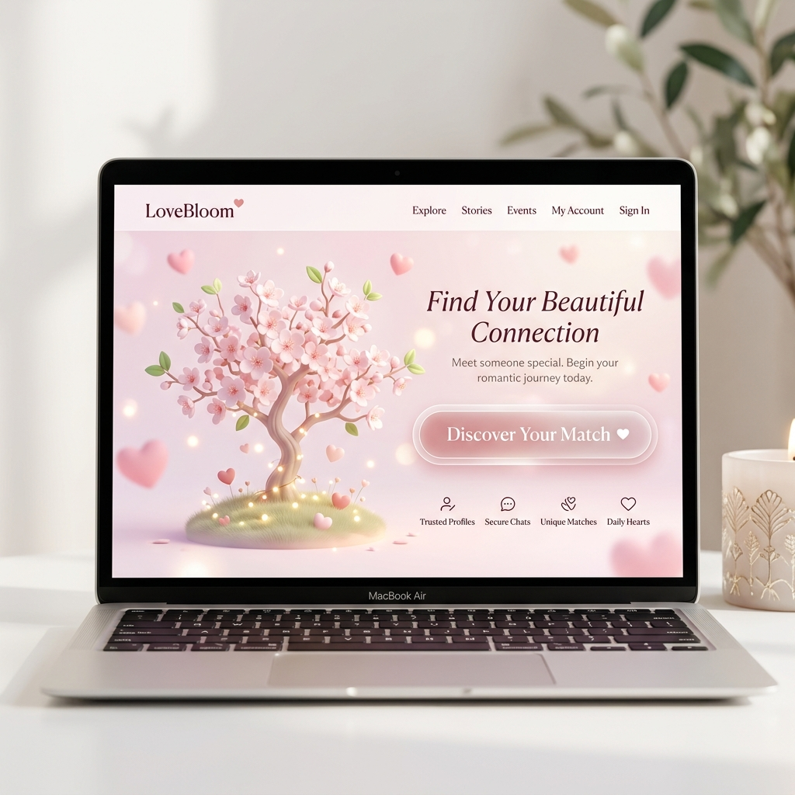

# Romantic Heart Tree

<!-- Banner Image -->
<div align="center">
  <picture>
    <source media="(prefers-color-scheme: dark)" srcset="./docs/banner-dark.png">
    <source media="(prefers-color-scheme: light)" srcset="./docs/banner-light.png">
    
  </picture>
</div>

<br />

<!-- UI Preview Image -->
<div align="center">
  <picture>
    <source media="(prefers-color-scheme: dark)" srcset="./docs/preview-dark.png">
    <source media="(prefers-color-scheme: light)" srcset="./docs/preview-light.png">
    
  </picture>
</div>


A dreamy, interactive romantic website built with Next.js, React, Tailwind CSS, Three.js (via React Three Fiber), and Framer Motion.

## What is included

- Animated 3D heart tree
- Falling heart petals and burst animation
- Typewriter romance lines
- Scroll/click story flow
- Gentle `Not sure` path with no-pressure messaging
- `Yes` celebration overlay with pulse/glow/floating hearts
- Responsive layout for mobile and desktop

## Run it

```bash
npm install
npm run dev
```

## Optional music

You can add a soft romantic audio file at:

```text
public/romance.mp3
```

Then connect it in `app/page.tsx` or a separate audio component on first user interaction.

## Notes

- The 3D tree is optimized with a small number of meshes and a modest DPR cap.
- The project uses the App Router.
- Make sure `tailwind.config.ts` and `postcss.config.js` are present at the project root.
